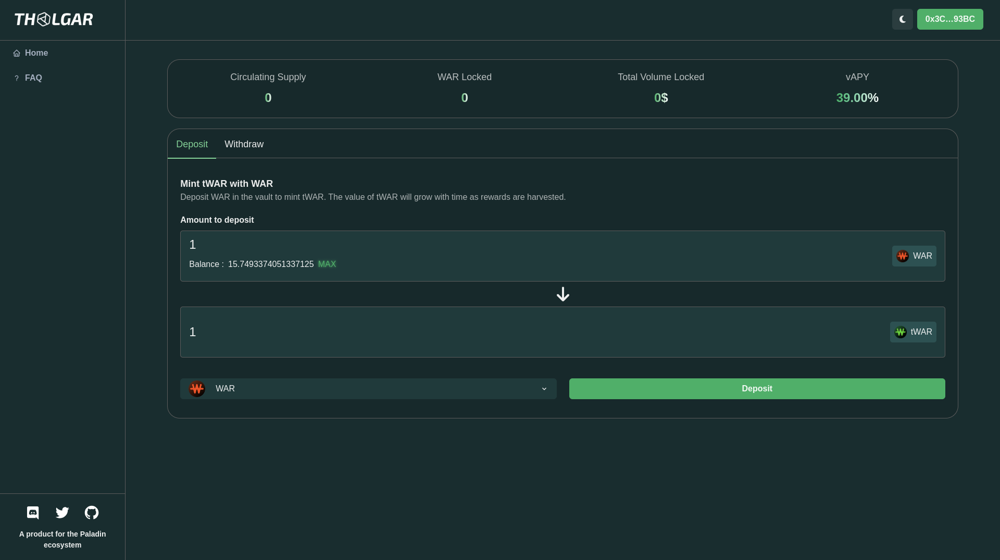
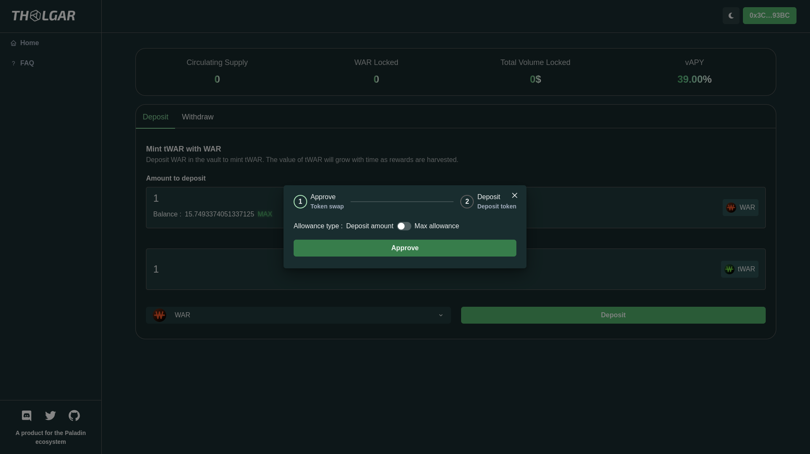
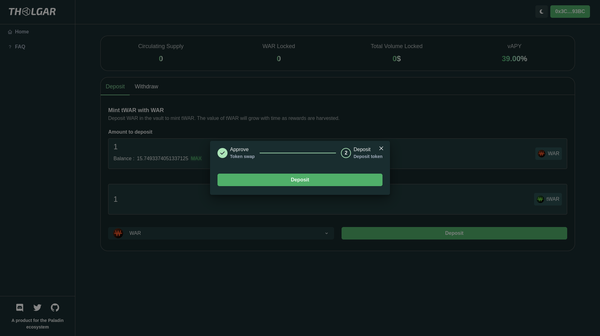
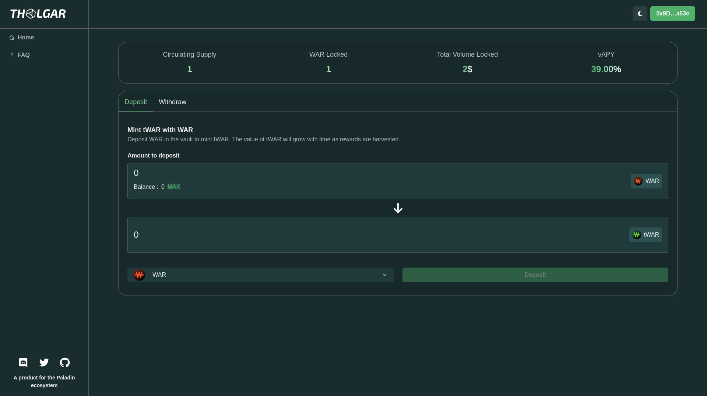
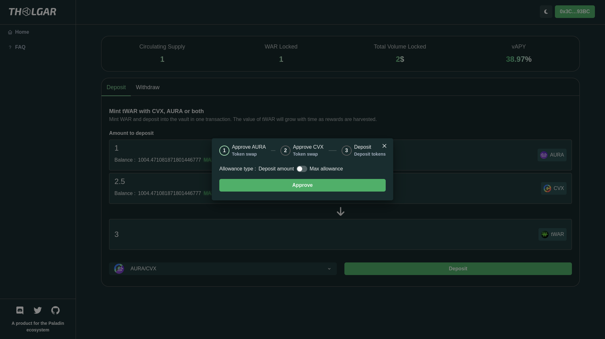
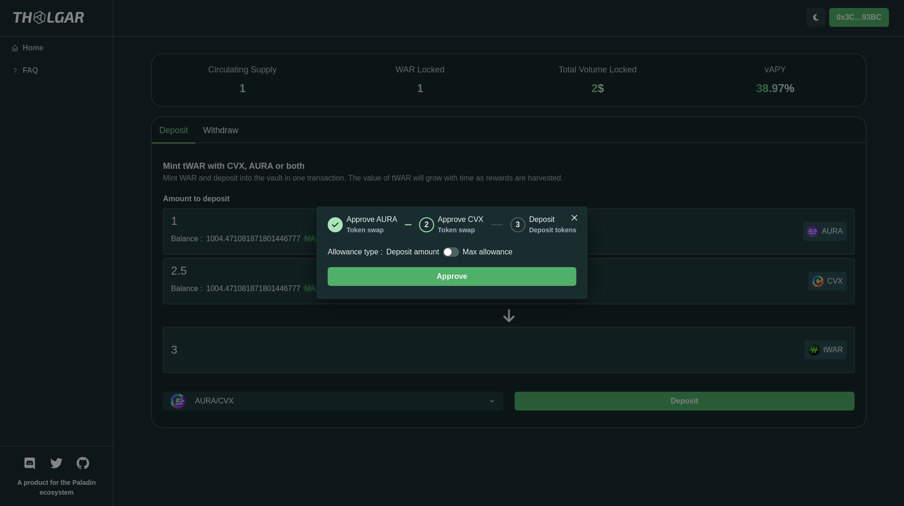
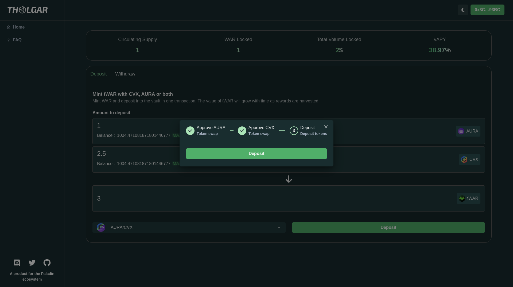
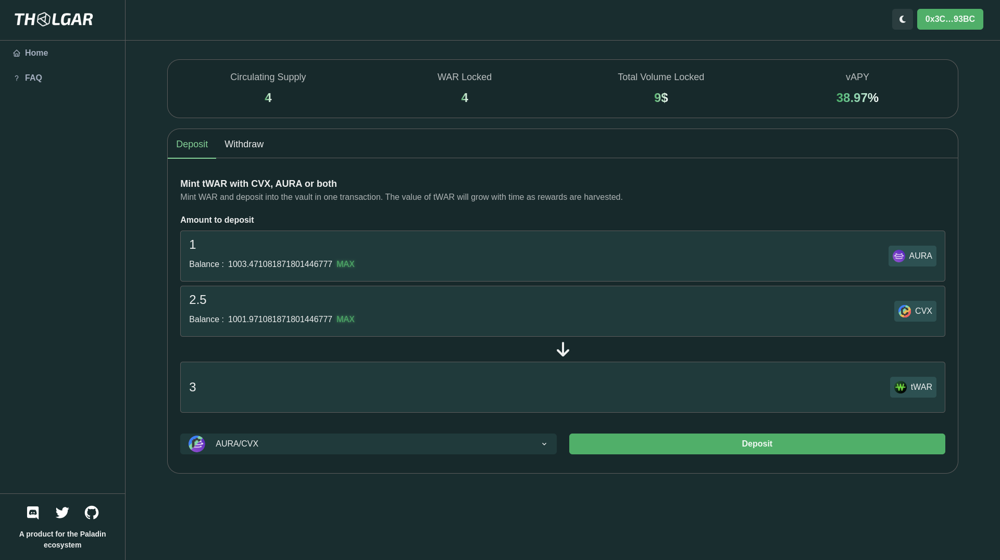

# Deposit

Currently, two set of tokens can be deposited : WAR and AURA/CVX. The process is nearly the same for both sets.

## Deposit WAR

### Accessing WAR deposit

The war deposit is the default option when the app is loaded. You can still retrieve it by selecting the deposit tab and selecting WAR token in the bottom-left dropdown.

### Depositing

#### Enter amount

Enter the desired amount of WAR you wish to deposit and click the "Deposit" button.

#### Approval

A dialog will open by first asking you to approve the WAR spending (according to ERC-20 standards).
You can select to approve only your deposit amount or approve the max spending to avoid this step on the following deposits.

#### Deposit

You will then be prompted to sign the transaction to deposit. This is the final step.

#### Verify

The "Circulating Supply" and "War Locked" stats should be increased by your deposit amount. If it is not immediatly the case, try to refresh you page.

## Deposit AURA/CVX
### Accessing AURA/CVX deposit

To access AURA/CVX deposit, you need to change the deposit token(s) by using the bottom-left dropdown in the deposit tab.

### Depositing

#### Enter amount

Enter the desired amount of AURA and/or CVX you wish to deposit and click the "Deposit" button.

#### Approval

A dialog will open by first asking you to approve the AURA and CVX spendings (according to ERC-20 standards).
You can select to approve only your deposit amount or approve the max spending to avoid those step on the following deposits.

#### Deposit

You will then be prompted to sign the transaction to deposit. This is the final step.

#### Verify

The "Circulating Supply" and "War Locked" stats should be increased by your deposit amounts wheighted by the current ratios. If it is not immediatly the case, try to refresh you page.

