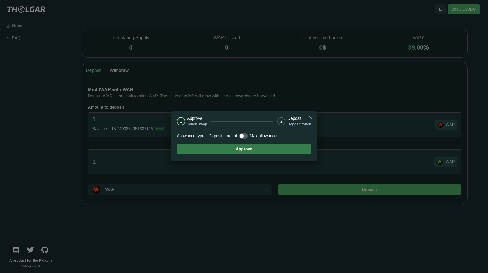
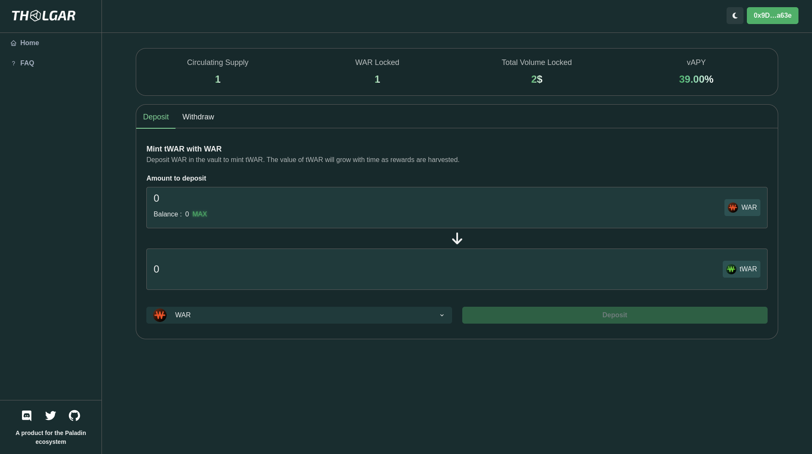
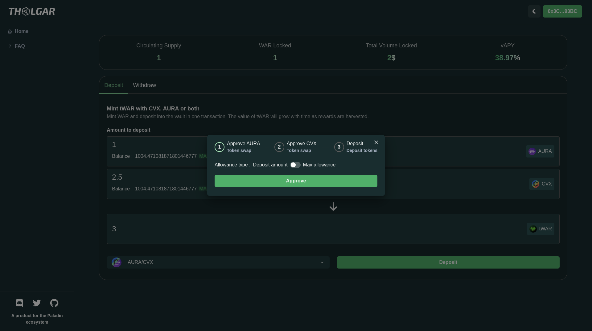
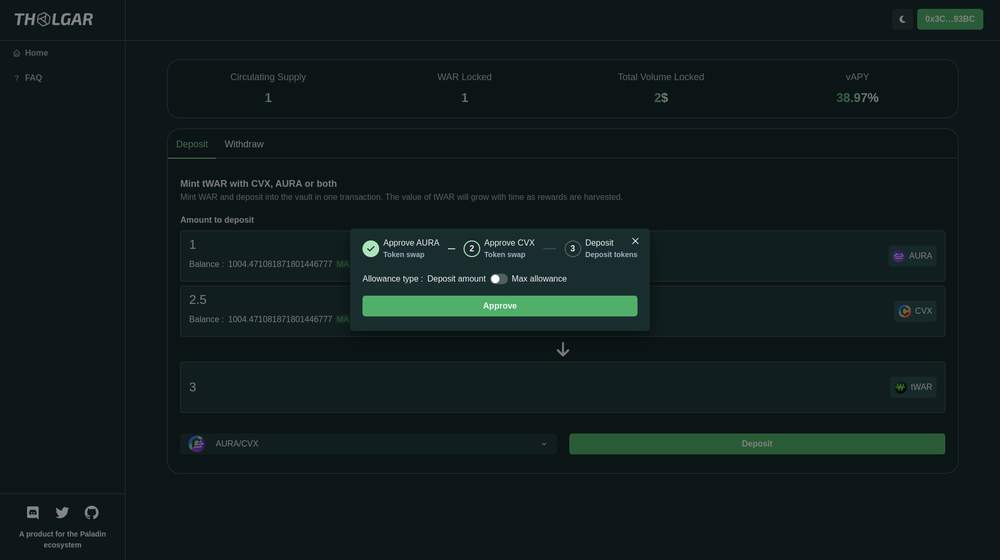
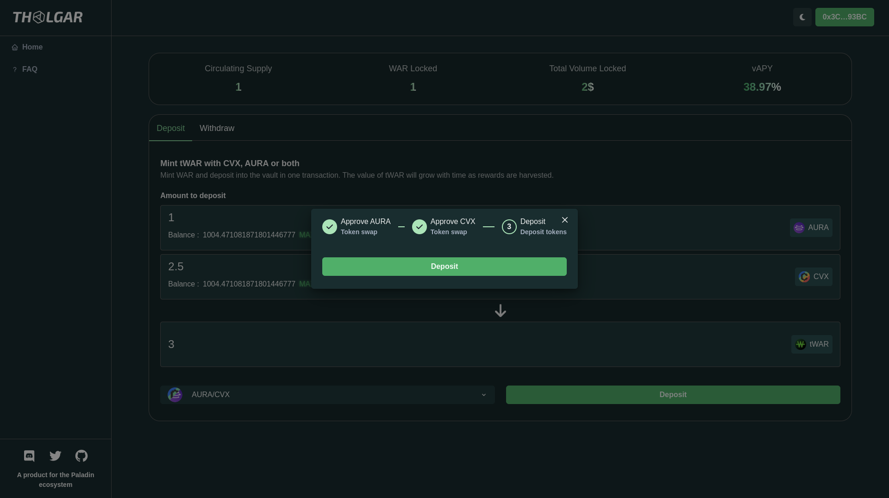
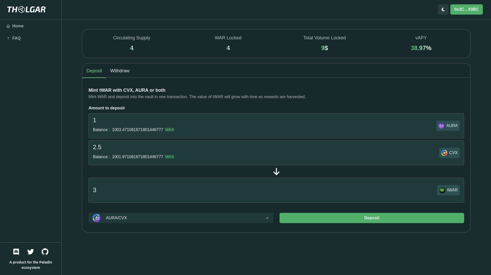

# Depositing

Currently, two set of tokens can be deposited: $WAR and $AURA/$CVX. The process is nearly the same for both sets.

## Depositing $WAR

### Accessing the $WAR deposit

The $WAR deposit is the default option when the app is loaded. However, you can still access it by clicking on the deposit tab and choosing the $WAR token in the bottom-left dropdown menu.

### Depositing

#### Amount to deposit

Input the desired amount of $WAR you intend to deposit and click the "Deposit" button.

#### Approval

A dialog will open, initially asking you to approve the spending of $WAR (in accordance with ERC-20 standards). You have the option to either approve only the deposit amount or approve the maximum spending to bypass this step in future deposits.

#### Deposit

You will then be prompted to sign the transaction to complete the deposit. This marks the final step in the process.

#### Verify

The "Circulating Supply" and "WAR Locked" statistics should reflect an increase by the amount of your deposit. If this change is not immediate, please try refreshing your page.

## Depositing $AURA/$CVX
### Accessing the $AURA/$CVX deposit

To access the $AURA/$CVX deposit, you need to switch the deposit token(s) by using the dropdown menu located in the bottom-left corner of the deposit tab.

### Depositing

#### Amount to deposit

Enter the desired amount of $AURA and/or $CVX you want to deposit, and then click the "Deposit" button.

#### Approval

A dialog will open, initially asking you to approve the spending of $AURA and/or $CVX (in accordance with ERC-20 standards). You have the option to either approve only the deposit amount or approve the maximum spending to bypass this step in future deposits.

#### Deposit

You will then be prompted to sign the transaction to complete the deposit. This marks the final step in the process.

#### Verify

The "Circulating Supply" and "WAR Locked" statistics should reflect an increase by the amount of your deposit. If this change is not immediate, please try refreshing your page.

