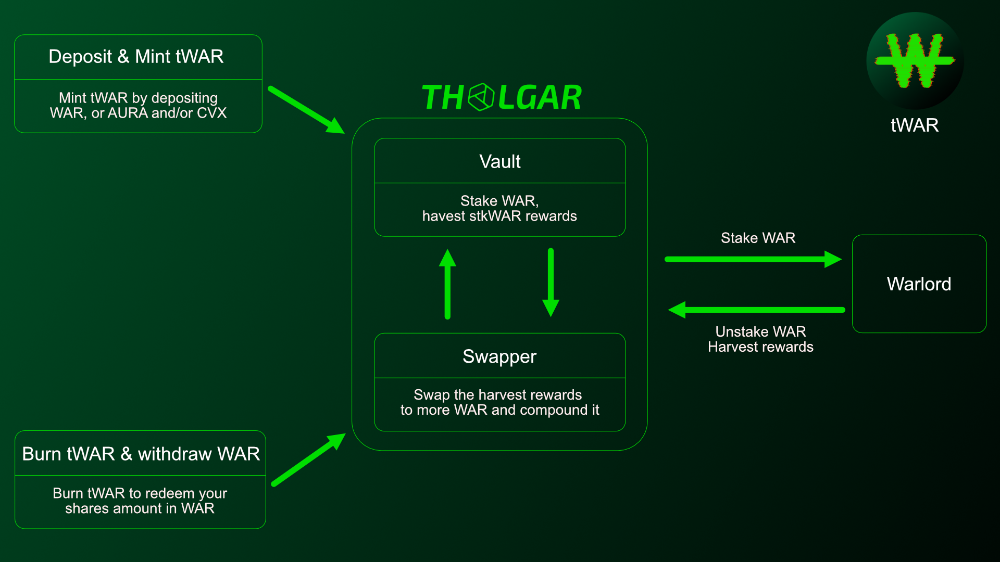

# Overview

## What is Warlord ?

Warlord is an index of governance tokens that generates yield and automatically compounds some ot the rewards into $WAR, optimizing the overall yield through an auto-voter for the most rewarding vote incentives. You can read more about it [here](https://doc.paladin.vote/warlord/overview).

## What is the Warlord Vault ?

The Warlord Vault is a product built by the Tholgar team. It is an auto-compounder built on top of Warlord, enabling anyone to participate in a Vault and achieve higher, more optimized yields in a non-custodial manner.

All vote incentives will be claimed on a weekly basis and automatically compounded into the Vault, resulting in even higher yields.

It follows the ERC-4626 standard, aligning with the industry standard developed by Yearn to enhance composability with other protocols.

## Addresses

- Vault: [0x188cA46Aa2c7ae10C14A931512B62991D5901453](https://etherscan.io/address/0x188ca46aa2c7ae10c14a931512b62991d5901453)
- Zap: [0x0598c652eEB0F95137Af02f32022005139453744](https://etherscan.io/address/0x0598c652eeb0f95137af02f32022005139453744)
- Swapper: [0x4247d145049B426d39f19F41555137D9cB154B99](https://etherscan.io/address/0x4247d145049b426d39f19f41555137d9cb154b99)
